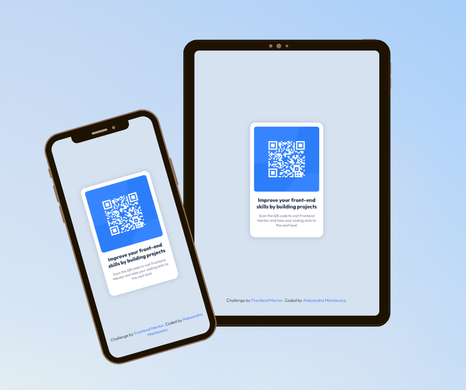

# QR-code-component-
### FrontEnd Mentor Challenge 

[Link to the GitHub Pages](https://aleksmark321.github.io/QR-code-component/).

#### My comment to the challenge.
This is my first mini project from the challenges prepared by Frontend Mentor. It is a simple window containing a QR code. In this project, I used the Sass preprocessor for the first time. According to the challenge documentation, media queries weren't used in the project. However, I believe that despite this, the project looks good on any screen size.

